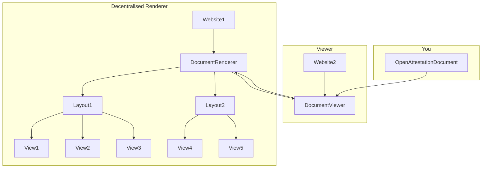

# Demo decentralised renderer

Read more about OpenAttestation's `Decentralised Renderer` Architectural Decision Records (ADR) [here](https://github.com/Open-Attestation/adr/blob/master/decentralised_rendering.md).

## Introduction

This repository is a bare minimal demostration of how an OpenAttestation `Decentralised Renderer` + Viewer works.

## How to run

Concurrently run both applications.

For Renderer:

```
cd renderer
npm i
npm run start
```

For Viewer:

```
cd viewer
npm run start
```

Then head to `http://127.0.0.1:8080/` to see a rendered OpenAttestation document.

## Overview


